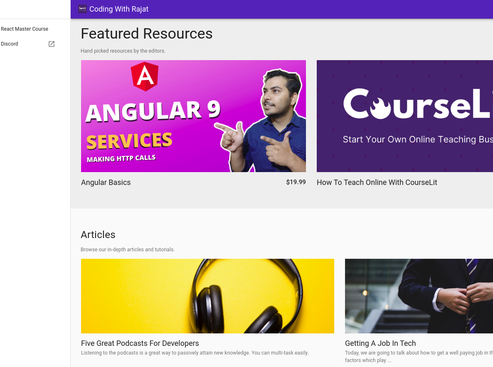
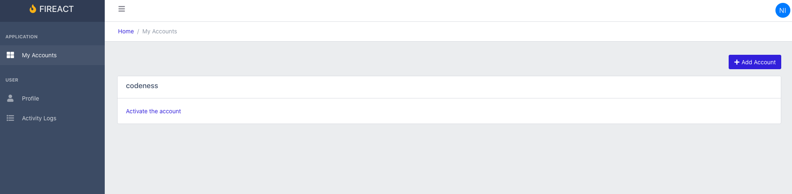

As you grow your knowledge in React.js, you will notice that there are many sources with simple code examples but only a few of advanced stuff. And many of them have "outdated code" (no hooks, class components everywhere, etc).

What if you want to know how to structure a medium to large codebase? Or if you want to know if you are doing everything fine?

One way to improve your skills is to study what other devs are doing. How they approach their projects can teach you lessons that maybe will take you weeks to learn.

That's why I made this list of open-source React.js applications you can learn from. All uses modern features such hooks, context and many uses redux-toolkit. So, no matter if you already have hit a plateau as seasoned developer or if you're just starting, take a look!

## 1) Take Note – [Live](https://takenote.dev/) | [Repo](https://github.com/taniarascia/takenote)    

Take Note is an open-source project to take notes, known as _The Note Taking App for Developers_

It's a simple plain-text take note app with markdown support. Without all the fancy stuff that we don't need :)

The code seems to be good organized:

It uses React hooks (yay!) and [redux-toolkit](https://redux-toolkit.js.org/https://redux-toolkit.js.org/https://redux-toolkit.js.org/https://redux-toolkit.js.org/) =) (see the _slices_ folder). See how `slices/auth.ts` looks like:

## 2) Cloud Music - [Repo](https://github.com/sanyuan0704/react-cloud-music)

This is a clone of _NetEase_, a cloud music streaming service. The README is in Chinese but the code is in plain English.

This project uses redux (without redux-toolkit) and hooks. What I find interesting in this project is the code structure:

At first, it seems pretty standard but after reviewing the reducer (_store/reducer.js_) I noticed that they are "grouping" (inside _application_ folder) some components and styles alongside the _redux_ logic:

## 3) Todoist clone - [Repo](https://github.com/karlhadwen/todoist)

[Karl Hadwen](https://www.youtube.com/channel/UC1DUQiZduv_yNZy0O7n_iHA) did this [Todoist](https://todoist.com/es) clone, and he even has a [video tutorial](https://www.youtube.com/watch?v=HgfA4W_VjmI) on Youtube.

For the _"backend"_, he used [Firebase](https://firebase.google.com/)instead of building an API from scratch. He used context and didn't use redux (yes, you don't always need to use redux).

## 4) Mortgage – [Live](https://paulhoughton.github.io/mortgage/) | [Repo](https://github.com/paulhoughton/mortgage)

_Mortgage_ is a mortgage overpayment calculator!

It uses [D3](https://d3js.org/) to draw the chart and hooks! It is a small app but it is a good start to learn how to use hooks in calculator-like applications.

## 5) Tomato Work – [Live](https://tomato-work.xiejiahe.com/) | [Repo](https://github.com/xjh22222228/tomato-work)

Tomato-work is a personal affairs management system written in React using hooks and redux:

For the UI, it uses [Antd](https://ant.design/), which is pretty awesome BTW. The code structure is standard:

What I find interesting is that it has a _services_ folder (remind me of angular) where each file is an abstraction to make API calls. So instead of calling axios directly in the component, he uses a service function instead.

## 6) Write with me – [Live](https://www.writewithme.dev) | [Repo](https://github.com/dabit3/write-with-me)   

_Write with me_ is a real-time collaborative markdown editor written in React with hooks and it uses [AWS Amplify](https://aws.amazon.com/es/amplify/)

As you can see, this is a small project:

So, the code structure is not organized using different folders. All the state management is done using `useReducer` hooks.

There is a `graphql` folder because Amplify works with graphql

## 7) JIRA Clone – [Live](https://jira.ivorreic.com/project/board) | [Repo](https://github.com/oldboyxx/jira_clone)

This is a simplified JIRA Clone, looks awesome!

Analyzing the code structure, you can see it uses cypress and jest for testing:

As the author says, it is a good example of a modern real-world React codebase. There are the features (from README):

## 8) Spectrum – [Live](https://spectrum.chat/) | [Repo](https://github.com/withspectrum/spectrum)

Spectrum is a platform that allows you to create and participate in awesome communities.

I have seen many people recommending this repository. And there is a good reason for this: **the repository is their entire product!**

> "That being said, this codebase isn't your typical open source project because it's not a library or package with a limited scope—it's our entire product."

In my opinion, this is one of the best open source full-stack react projects that shows off how to properly structure a large codebase

The frontend SPA (react) lives in `src` folder

As you can infer from the folder structure, they split the code by "type" of code (components, reducers, hooks, etc).

## 9) GitHub profile README Generator – [Live](https://rahuldkjain.github.io/gh-profile-readme-generator/) | [Repo](https://github.com/rahuldkjain/github-profile-readme-generator)

This tool provides an easy way to create GitHub profile README with the latest add-ons like visitors count, GitHub stats etc.

This is an example of a [Gatsby](https://www.gatsbyjs.com/) project that uses hooks. The files are organized by type which is fine for the size of the project:

If you haven't created your GitHub profile, maybe you can now by using this tool ([I did!](https://github.com/muzk/))

## 10) Moose - [Live](https://getmoose.in/) | [Repo](https://github.com/ritz078/moose) 

Moose is an application to stream, cast and download torrents built with [Nextron](https://github.com/saltyshiomix/nextron).

What is Nextron? It's "Next.js" (for Server Side Rendering) + "Electron" (to built desktop app using web technologies).

I don't have experience building this kind of apps. But as far I can see, the file structure is by _file type_:

The project uses [TypeScript](https://www.typescriptlang.org/) and for custom styles [css-modules](https://github.com/css-modules/css-modules)

## 11) Courselit - [Live] | [Repo](https://github.com/codelitdev/courselit)

Courselit is an app that helps you to start your own online teaching business. 

How? Well, it is a CMS (content management system) for starting creating your own courses which uses Stripe to receive payments. It is an alternative to paid solutions (like Teachable).

Frontend is built with [Preact](https://preactjs.com/) (instead of React) with [Next](https://nextjs.org/):

Backend is [Express](https://expressjs.com/) with [MongoDB](https://www.mongodb.com/).

Something interesting is that this is a [MonoRepo](https://en.wikipedia.org/wiki/Monorepo), which means in the same github repo lives frontend and backend as separated packages (see `packages`). To manage multiple javascript packages in the same repository, it uses [Lerna](https://github.com/lerna/lerna).

## 12) Fireact - [Repo](https://github.com/chaoming/fireact) - [Live](https://fireact-e1bdc.firebaseapp.com/) 

Fireact is an app to build your own [SaaS](https://en.wikipedia.org/wiki/Software_as_a_service) where you can receive payments through [Stripe](https://stripe.com/es-us).

It is a full-stack app built with [Firebase](https://firebase.google.com/) and React ([CRA](https://github.com/facebook/create-react-app)).

File structure is a mix betweeen "file types":

And "by page". Pages are split between "auth pages" and "without auth":

It uses [Firestore](https://firebase.google.com/docs/firestore) as you can see in `UserList` ([here](https://github.com/chaoming/fireact/blob/master/src/pages/auth/accounts/UserList/index.js#L39)).

And for the UI, it uses [coreui](https://coreui.io) which is an Admin template for Bootstrap:

## Did I miss a project?

It was a bit hard to find open-source projects using the latest react tools (e.g. hooks) 😓. 

Reply in the comments if you think I miss a cool modern project 😊
